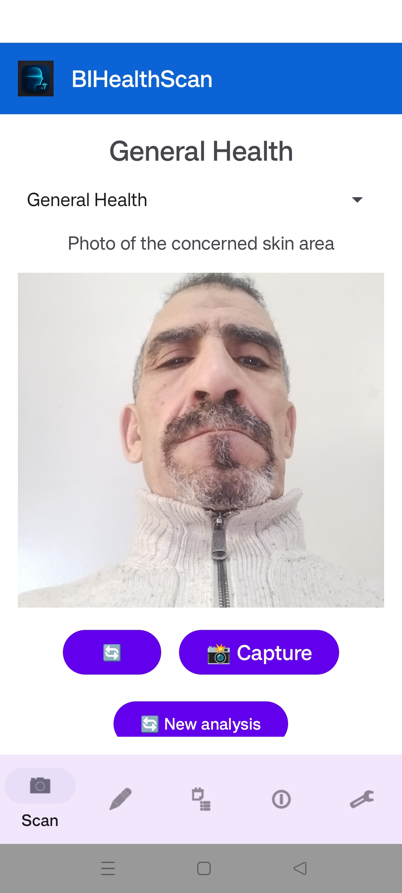
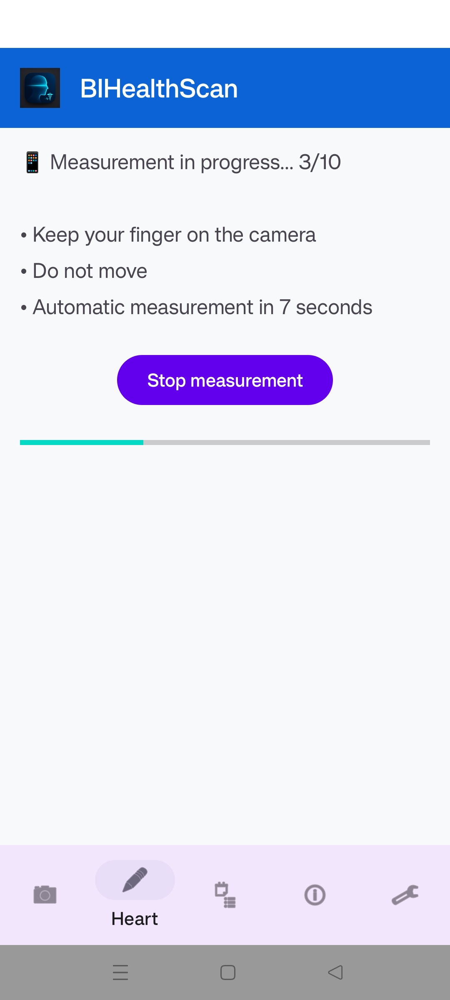
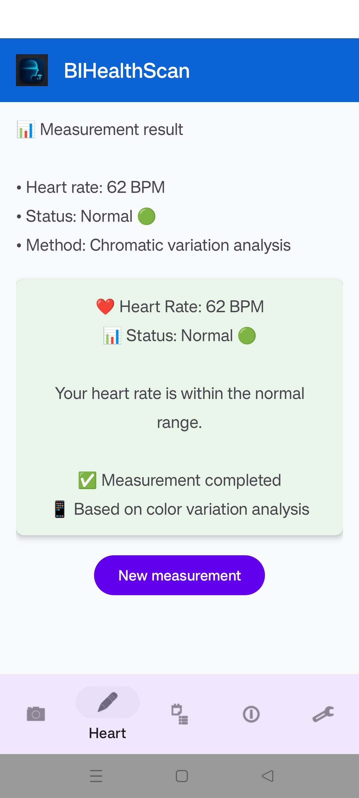
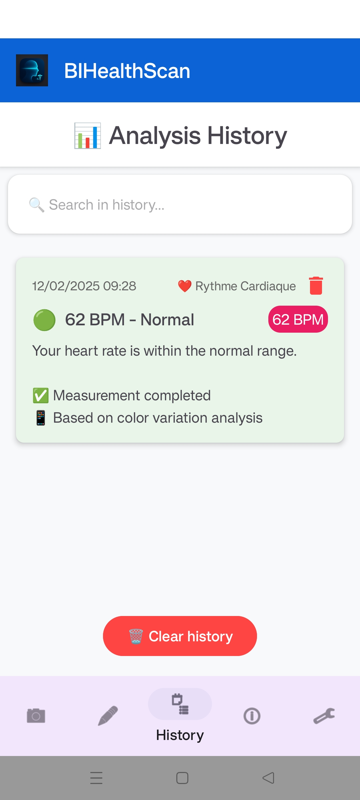
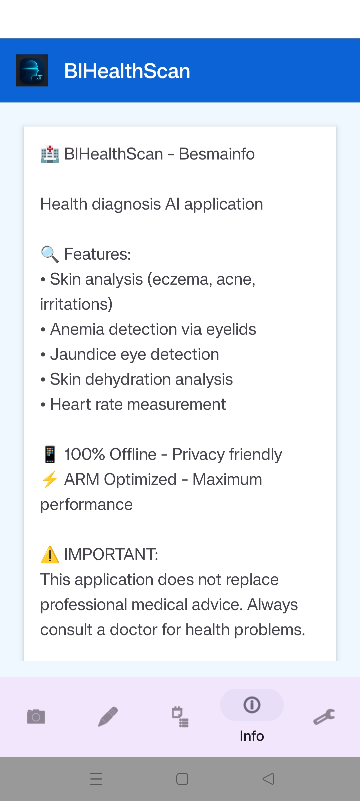
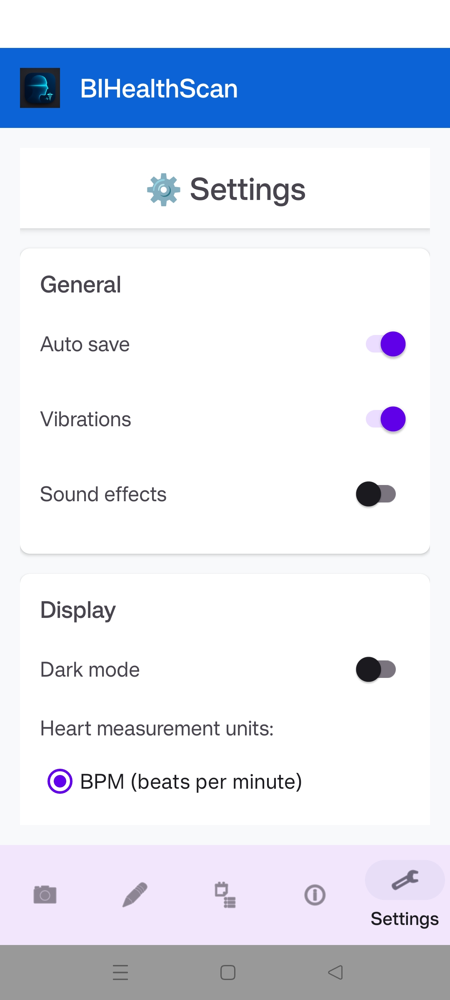

# BIHealthScan

BIHealthScan is an intelligent mobile health‑scanning application designed to accelerate triage, optimize patient record management, and deliver AI‑assisted medical analysis. It is developed by **BesmaInfo** within the BISmart innovation ecosystem.

---

## 1. Overview

BIHealthScan leverages advanced image processing, on‑device machine learning (TensorFlow Lite), and modern Android development (Material Design 3, MVVM, ViewBinding) to provide:

* AI‑assisted medical scan analysis
* Patient history and record management
* Local or cloud‑based data storage (Firebase optional)
* Modern, responsive UI/UX
* Offline‑first architecture

---

## 2. Key Features

* **AI Scan Engine** powered by TensorFlow Lite
* **Patient History & Medical Records**
* **Emergency Contact & Triage Workflow**
* **Fast Search and Filtering**
* **Dark/Light Theme (Material3)**
* **Secure MVVM Architecture**

---

## 3. Technology Stack

* **Language:** Java (Android)
* **UI Framework:** Material Design 3
* **Architecture:** MVVM + ViewBinding / DataBinding
* **AI Engine:** TensorFlow Lite (INT8 quantized models)
* **Database:** Room Database / Firebase
* **Build System:** Gradle

---

## 4. Screenshots

<div style="display:flex; flex-wrap:wrap; gap:16px;">
  <div><strong>Scan</strong><br></div>
  <div><strong>Heart Rate</strong><br></div>
  <div><strong>Heart Result</strong><br></div>
  <div><strong>History</strong><br></div>
  <div><strong>Info</strong><br></div>
  <div><strong>Settings</strong><br></div>
</div>

---

## 5. System Architecture

```
┌────────────────────────────────────────────────────────────┐
│                        BIHEALTHSCAN APP                    │
├────────────────────────────────────────────────────────────┤
│ Presentation Layer    │ Business Logic       │ Data Layer  │
│ • Activities/Fragments│ • AI Analysis Engine │ • Room DB   │
│ • Material 3 UI       │ • Health Logic       │• Preferences│
│ • Camera Integration  │ • Config Mgmt        │• Cloud Sync │
└───────────────┬───────────────┬────────────────────────────┘
                │               │
      ┌─────────▼──────────┐   ┌─────────▼──────────┐
      │   TensorFlow Lite  │   │   ARM NN Runtime   │
      │   AI Inference     │   │ Optimized Execution│
      │ • Quantized INT8   │   │ • NEON SIMD        │
      │ • On‑device Models │   │ • AArch64 Native   │
      └────────────────────┘   └────────────────────┘
```

---

## 6. Project Structure

```
BIHealthScan/
├── app/
│   ├── src/main/
│   │   ├── java/com/besmainfo/bihealthscan/
│   │   │   ├── data/        # Data management
│   │   │   ├── ml/          # TensorFlow Lite AI
│   │   │   ├── ui/          # Activities & Fragments
│   │   │   └── utils/       # Utilities
│   │   ├── assets/          # AI model (.tflite)
│   │   └── res/             # Android resources
│   └── build.gradle.kts     # Build configuration
│
├── documentation/
│   ├── screenshots/         # App screenshots
│   ├── demo_video/          # Demo videos
│   └── architecture_diagram/# Architecture diagrams
│
└── README.md
```

---

## 7. Installation & Build

### Requirements

* androidIDE
* Android SDK 34+
* Gradle 8+

### Build

```
./gradlew assembleDebug
```

Or use androidIDE Build menu.

### Install APK (if provided)

Download the latest release APK from the **Releases** section.

---

## 8. TensorFlow Lite Integration

Place your model in:

```
app/src/main/assets/model.tflite
```

Load it in Java:

```java
Interpreter tflite = new Interpreter(loadModelFile(context, "model.tflite"));
```

The AI logic is located under:

```
com.besmainfo.bihealthscan.ml
```

---

## 9. Firebase Integration (Optional)

Add your `google-services.json` in:

```
app/
```

Enable the plugin:

```
id("com.google.gms.google-services")
```

---

## 10. Contribution

Contributions, feature proposals, and improvements are welcome. Please follow Android clean‑architecture guidelines and commit standards.

---

## 11. License

This project is under the BesmaInfo internal license. Contact the project owner for usage rights.

---

## 12. Contact

* Team: **BesmaInfo**
* GitHub: [https://github.com/BCBLearning](https://github.com/BCBLearning)
* Lead Developer: @Tedj_Tedj
